# PM Copilot — User Manual

> Version 1.2 · Mai 2026

---

## Table of Contents

1. [Introduction](#1-introduction)
2. [Getting Started](#2-getting-started)
3. [Projects](#3-projects)
4. [PRD Starter](#4-prd-starter)
5. [The Explorer](#5-the-explorer)
6. [Artifacts](#6-artifacts)
7. [Relations](#7-relations)
8. [AI Suggestions](#8-ai-suggestions)
9. [Comments](#9-comments)
10. [Version History](#10-version-history)
11. [Tags](#11-tags)
12. [Search](#12-search)
13. [Artifact Graph](#13-artifact-graph)
14. [Document Import](#14-document-import)
15. [Board View](#15-board-view)
16. [Progress View](#16-progress-view)
17. [Traceability View](#17-traceability-view)
18. [Roles and Permissions](#18-roles-and-permissions)
19. [Admin Area](#19-admin-area)
20. [Keyboard Shortcuts](#20-keyboard-shortcuts)

---

## 1. Introduction

PM Copilot is a structured product management workspace. It gives every piece of product knowledge a **type**, a **status**, and **explicit links** to other artifacts — from the first problem statement to the final launch task.

### Core concept

Traditional PM work is scattered across documents, Notion pages, and Jira tickets with no consistent structure and no traceability between decisions. PM Copilot provides:

- **35 artifact types** across 8 domain groups — a shared vocabulary for the whole team
- **Traceability** — explicit links showing how a business goal connects to a persona, a hypothesis, a feature, and an acceptance criterion
- **Gap detection** — the system shows what is missing, not just what exists
- **AI assistance** — context-aware suggestions that you review and accept, never auto-applied
- **Version history** — every save creates a version; you can restore any earlier state

### Who is it for?

Product managers, product owners, and their immediate collaborators (designers, engineers, stakeholders). Each person gets a role — Owner, Editor, or Viewer — that controls what they can do.

---

## 2. Getting Started

### Registering an account

1. Go to `http://localhost:3000/register`
2. Enter your name, email address, and a password (min. 8 characters)
3. Click **Register** — you are logged in immediately

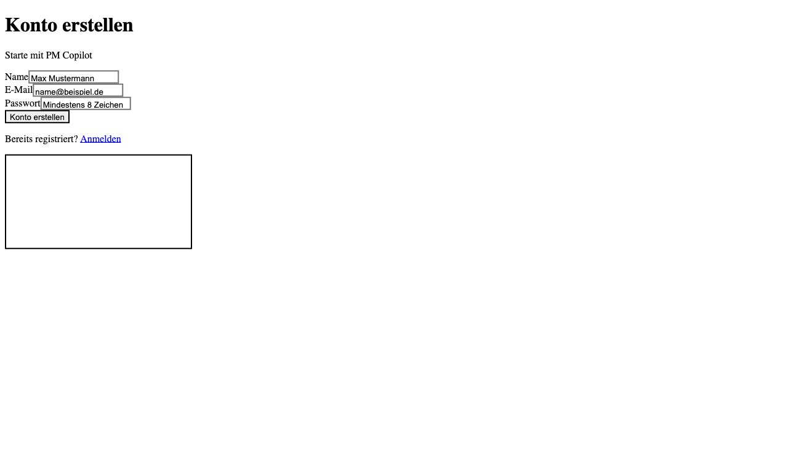

> If self-registration is restricted in your organisation, ask your system admin to create an account for you via the Admin area.

### Logging in

1. Go to `http://localhost:3000/login`
2. Enter your email and password
3. Click **Log in**

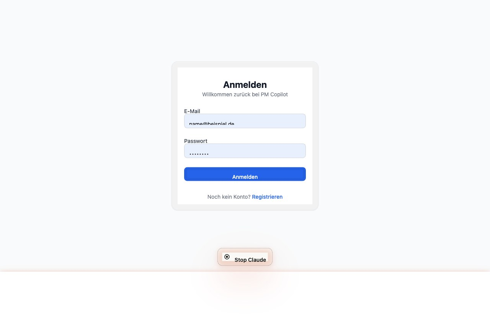

### Logging out

Click your name or avatar in the bottom of the sidebar, then click **Log out** (or the logout button that appears in the sidebar footer).

---

## 3. Projects

A **project** is the top-level container. Everything — artifacts, relations, comments, versions — lives inside a project.

### Creating a project

1. Click **New project** on the Projects overview page (`/projects`)
2. Enter a project name (required) and an optional description
3. Click **Create project** — you are taken directly to the **PRD Starter** to fill in the 10 foundation questions before creating your first artifact

### Project list

The Projects page shows two sections:

- **Active projects** — projects you are a member of with status ACTIVE
- **Archived projects** — read-only, shown below active projects

Each card shows the project name, description, your role, and how many artifacts it contains.

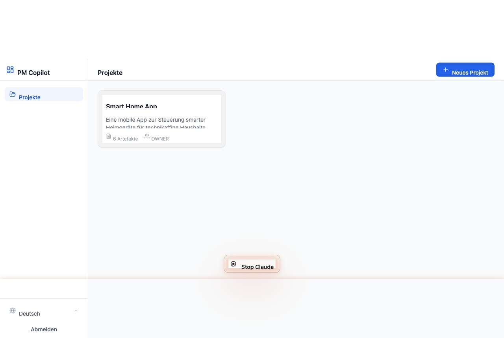

### Editing a project

Open the project, click **Settings** in the top-right header (visible to Owners only).

- Change the name and description
- Invite or remove team members
- Archive or delete the project

### Archiving a project

In **Settings**, click **Archive project**. An archived project becomes read-only — no new artifacts, edits, or relations can be created via the API or UI. You can reactivate it at any time by clicking **Reactivate**.

### Deleting a project

In **Settings**, click **Delete project** and confirm. This permanently removes the project and all its artifacts.

---

## 4. PRD Starter

The PRD Starter captures the **10 minimum questions** needed before writing a PRD. It acts as a shared foundation that is surfaced as context when editing related artifacts, keeping detailed content consistent with high-level decisions.

### Accessing the Starter

- **At project creation** — you are redirected here automatically after creating a new project
- **Later** — click the **Starter** button (rocket icon) in the explorer header at any time

### The 10 questions

| # | Question | Ausgearbeitet in (UI-Label) |
|---|---|---|
| 1 | What is the product idea? | Produktvision |
| 2 | What problem does it solve? | Problemstellung |
| 3 | Who has this problem? | Nutzer-Persona, Käufer-Persona |
| 4 | How do users solve this problem today? | Problemstellung |
| 5 | Why is the current solution insufficient? | Problemstellung |
| 6 | What is the desired outcome? | Ziele & Nicht-Ziele |
| 7 | What is the first use case? | Anwendungsfall |
| 8 | What are the must-have features for v1? | Feature, Epic |
| 9 | What is out of scope for v1? | Ziele & Nicht-Ziele |
| 10 | How will success be measured? | KPI/OKR, Messplan |

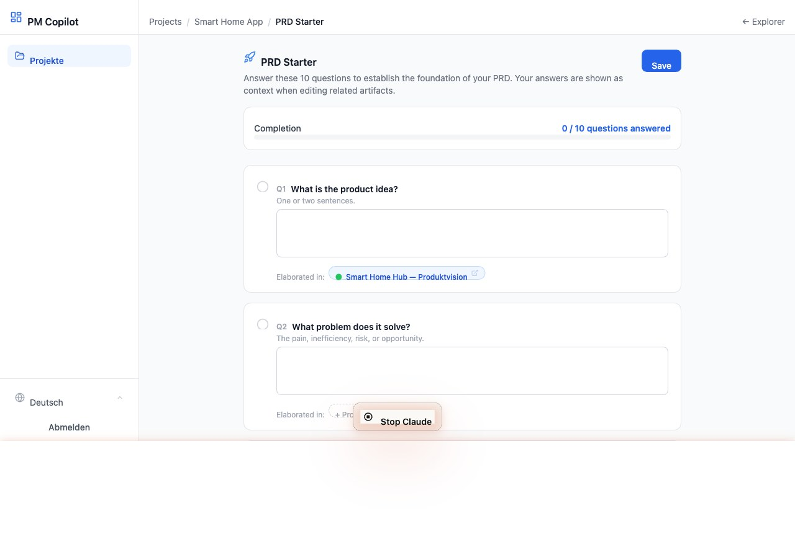

### Completion bar

The top of the Starter page shows how many of the 10 questions have been answered. A progress bar fills as you answer questions.

### Artifact links

Below each question you will see colored badge chips for artifact types that elaborate on that answer:

- **Colored chip** (e.g. blue "Produktvision") — an artifact of that type already exists; click the chip to open it
- **Dashed chip** (e.g. "+ Nutzer-Persona") — no artifact of that type exists yet; click it to create one

### Inline context panel

When you open or create an artifact that has relevant starter answers, a blue **PRD Starter context** panel appears above the form. It shows the relevant questions and your answers so you can keep the artifact consistent. Collapse it with the chevron if you don't need it. Click **PRD Starter bearbeiten** to update the answers.

---

## 5. The Explorer

The Explorer is the main workspace for a project. It uses a two-column layout:

```
+------------------+------------------------------------------+
|  Artifact tree   |  Detail panel                            |
|                  |                                          |
|  FOUNDATIONS     |  [artifact form / create form / hint]   |
|    Goals...      |                                          |
|    Stakeholder   |  Relations                               |
|  RESEARCH        |  Comments                                |
|    Problem...    |  Version history                         |
+------------------+------------------------------------------+
```

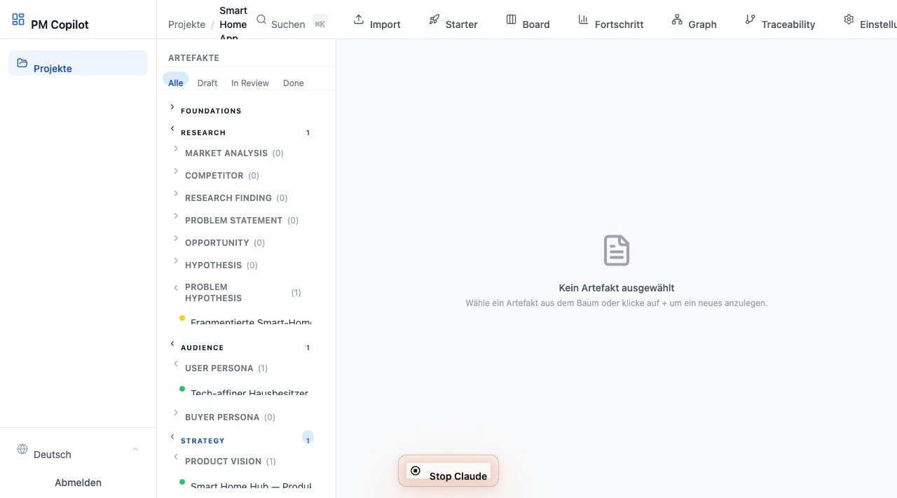

### Left panel — Artifact tree

Artifacts are grouped by **domain group** (8 groups, color-coded). Within each group, types are listed as sub-groups. Types with 0 artifacts start collapsed to keep the tree clean.

**Group colors:**

| Group (German UI label) | Color |
|---|---|
| Grundlagen | Slate |
| Recherche | Violet |
| Zielgruppe | Pink |
| Strategie | Blue |
| Discovery & Gestaltung | Cyan |
| Lieferung | Green |
| Planung & Release | Orange |
| Feedback & Iteration | Rose |

**Status dots** next to each artifact:

- Green dot — Fertig
- Yellow dot — In Prüfung
- Grey dot — Entwurf

**Filter bar** at the top of the tree: filter by Alle / Entwurf / In Prüfung / Fertig.

**Creating an artifact from the tree:** Hover over a type group — a `+` button appears. Click it to open a create form for that type in the right panel.

### Right panel — Detail panel

Depending on the URL:

- **No selection** — a hint explaining how to select or create an artifact
- **`?artifact=ID`** — the full artifact form with all sections below it
- **`?new=TYPE`** — a blank create form for that type

### Unsaved changes guard

If you have unsaved changes in the form and click a different artifact in the tree (or the `+` button), a confirmation dialog appears: **Discard and switch** or **Cancel**. This prevents accidentally losing edits.

---

## 6. Artifacts

An artifact is any structured piece of product knowledge. Every artifact has:

- A **type** (determines which fields are shown)
- A **title**
- A **status** (Entwurf / In Prüfung / Fertig)
- **Type-specific fields** (see below)
- Relations, comments, tags, and a version history

### All 35 artifact types

#### Grundlagen (slate)

| UI-Label | Purpose | Key fields |
|---|---|---|
| **Ziele & Nicht-Ziele** | What is in scope and what is explicitly out of scope | Goals, Non-goals, Rationale |
| **Stakeholder** | A person or group with interest in the product; RACI role | Name, Role, RACI, Interests, Influence |
| **Annahme** | A belief held without full evidence | Assumption, Rationale, Impact if wrong, Validation |
| **Rahmenbedingung** | A boundary that limits options (technical, budget, regulatory, time, resource) | Constraint, Type, Rationale, Impact |
| **Offene Frage** | An unresolved question that needs an answer | Question, Context, Owner, Due date, Resolution |

#### Recherche (violet)

| UI-Label | Purpose | Key fields |
|---|---|---|
| **Marktanalyse** | Overview of the market landscape | Summary, Market size, Trends, Sources |
| **Wettbewerber** | Analysis of a specific competitor | Name, SWOT (Strengths, Weaknesses, Opportunities, Threats), Positioning |
| **Forschungsergebnis** | A single insight from user or market research | Insight, Method, Participants, Implications |
| **Problemstellung** | A clearly articulated problem worth solving | Problem, Context, Impact, Current workaround, Why insufficient |
| **Chance** | A potential area where the product can create value | Description, Target audience, Value potential, Timing |
| **Hypothese** | A testable belief: "We believe X because Y, confirmed when Z" | Belief, Rationale, Test, Confirmation criteria |

#### Zielgruppe (pink)

| UI-Label | Purpose | Key fields |
|---|---|---|
| **Nutzer-Persona** | Archetype of a primary user | Name, Goals, Pain points, Context |
| **Käufer-Persona** | Archetype of the economic buyer (may differ from user) | Name, Role, Goals, Pain points, Buying criteria |

#### Strategie (blue)

| UI-Label | Purpose | Key fields |
|---|---|---|
| **Produktvision** | The long-term direction and purpose | One-liner, Target users, Value proposition |
| **Wertversprechen** | Why users choose this product over alternatives | Statement, Target customer, Benefits, Differentiation |
| **Positionierung** | How the product is positioned in the market | Positioning statement, Target segment, Key message |
| **Geschäftsmodell** | How the product creates and captures value | Revenue streams, Cost structure, Channels, Partners |
| **KPI / OKR** | Measurable objectives and key results | Objective, Key results, Metrics, Period, Owner |
| **Messplan** | How outcomes will be tracked systematically | Objective, Key metrics, Baseline, Target, Instrumentation, Review cadence |

#### Discovery & Gestaltung (cyan)

| UI-Label | Purpose | Key fields |
|---|---|---|
| **Anwendungsfall** | A concrete interaction between a user and the product | Actor, Goal, Flow (steps), Preconditions |
| **User Journey** | End-to-end experience across multiple steps | Actor, Scenario, Journey steps, Pain points, Opportunities |
| **Feature** | A distinct product capability | Description, User value, In scope, Out of scope, Priority |
| **Epic** | A large body of work containing multiple features or stories | Description, Goals, Scope, Success criteria |

#### Lieferung (green)

| UI-Label | Purpose | Key fields |
|---|---|---|
| **User Story** | "As a [role] I want [action] so that [benefit]" | Role, Action, Benefit |
| **Funktionale Anforderung** | What the system must do | Description, Acceptance criteria |
| **Nichtfunktionale Anforderung** | Quality attributes (performance, security, scalability) | Description, Category, Metric, Acceptance |
| **Abnahmekriterien** | Given/When/Then test conditions | Given, When, Then, Preconditions, Expected outcome |
| **Abhängigkeit** | A dependency between two work items | Description, From, Type, Impact, Owner |
| **Risiko** | A potential problem and its mitigation | Description, Probability, Impact, Mitigation, Owner |
| **Entscheidung** | An architectural or product decision and its rationale | Context, Decision, Rationale, Alternatives, Consequences |
| **Testplan** | Scope and approach for testing a feature or release | Scope, Approach, Entry/Exit criteria, Test risks, Owner |
| **Compliance-Anforderung** | A regulatory or legal obligation | Requirement, Regulation, Deadline, Scope, Implementation, Owner |

#### Planung & Release (orange)

| UI-Label | Purpose | Key fields |
|---|---|---|
| **Roadmap-Eintrag** | A planned chunk of work on the roadmap | Description, Timeframe, Features, Rationale |
| **Release** | A versioned release of the product | Version, Target date, Description, Scope, Release notes |
| **Launch-Aufgabe** | A task required before or at launch | Description, Owner, Due date, Checklist |
| **Meilenstein** | A significant point in the project timeline | Description, Target date, Owner, Success criteria, Status |

#### Feedback & Iteration (rose)

| UI-Label | Purpose | Key fields |
|---|---|---|
| **Feedback** | A piece of user or stakeholder feedback | Source, Sentiment, Content, Actions |
| **Iteration** | Learnings and next steps from a sprint or cycle | Description, Learnings, Improvements, Next steps |

---

### Creating an artifact

1. Hover over a type group in the tree and click `+`, or click a dashed "+ [Type]" link in the Starter
2. Enter a title and fill in the type-specific fields
3. Click **Create artifact**
4. You are redirected to the new artifact's detail view

### Editing an artifact

Click any artifact in the tree to open it. Edit fields directly in the form. Click **Save** (or press the button at the bottom of the form). A "Saved" confirmation appears briefly.

Every save creates a new entry in the version history automatically.

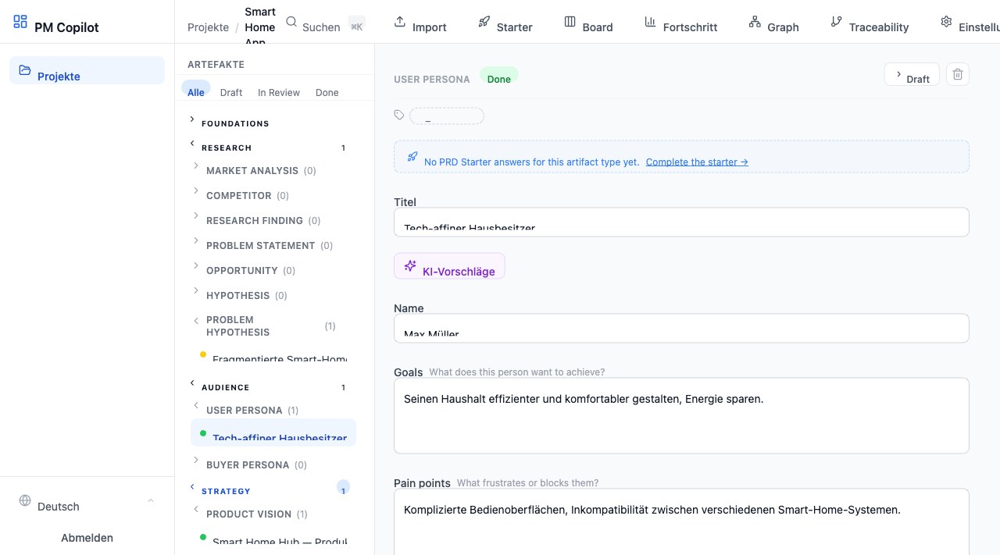

### Changing status

The status button in the artifact header cycles through statuses with one click:

**Entwurf → In Prüfung → Fertig → Entwurf**

The button always shows what clicking it will do next. This is a direct save — no form save required.

### Deleting an artifact

Click the trash icon in the artifact header and confirm. The artifact is soft-deleted (marked as deleted, not physically removed) and disappears from the tree. It cannot be recovered through the UI once deleted.

---

## 7. Relations

Relations connect artifacts to build the product knowledge graph. Every relation has a **direction** (source → target) and a **type**.

### Relation types

| UI-Label | Meaning | Example |
|---|---|---|
| **Abgeleitet von** | This artifact originates from another | User Story derived from Use Case |
| **Abhängig von** | This artifact cannot proceed without another | Release depends on Test Plan |
| **Verknüpft mit** | A general connection without a specific direction | Risk related to Assumption |
| **Validiert** | This artifact provides evidence for another | Research Finding validates Hypothesis |

### Adding a relation

1. Open an artifact
2. Scroll to the **Relations** section below the form
3. Click **Add relation**
4. Select the **target artifact** from the dropdown (grouped by domain)
5. The **relation type** is auto-suggested based on the source and target types — you can override it
6. Click **Link**

### Viewing relations

The Relations section shows all connections — both outgoing (this artifact → other) and incoming (other → this artifact). Each entry shows the relation type, the linked artifact's title and type, and its status dot.

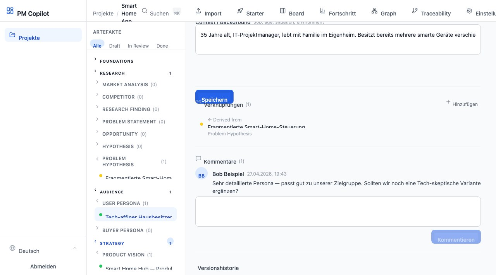

### Removing a relation

Click the delete icon next to any relation and confirm.

---

## 8. AI Suggestions

AI suggestions help you fill in artifact fields based on the artifact's current content and its linked artifacts as context.

### Requesting suggestions

1. Open an artifact in edit mode (Editor role required)
2. Click the **Ask AI** button (purple, below the title)
3. Wait for the response (up to 30 seconds depending on the provider)
4. Suggestions appear in a panel below the button — each field suggestion shown separately

### Accepting suggestions

- Click the **checkmark** next to any individual suggestion to apply it to that field
- Click **Accept all** to apply every suggestion at once
- Accepted suggestions are removed from the panel; the form fields update immediately

> AI suggestions are **never applied automatically**. Every suggestion requires an explicit click to accept. Accepting a suggestion does not save the artifact — you still need to click **Save**.

### When AI is unavailable

If no AI provider is configured (or the API key is invalid), the Ask AI button is hidden. Your system admin can configure the AI provider in the Admin area.

---

## 9. Comments

Comments provide a discussion thread attached to each artifact.

### Adding a comment

Scroll to the **Comments** section below the relations. Type your comment in the text field and click **Send**. All project members (including Viewers) can comment.

### Viewing comments

Comments are shown oldest-first with the author's name, initials avatar, and timestamp.

---

## 10. Version History

Every time you save an artifact (or accept AI suggestions, or change status), a new version is created automatically.

### Viewing versions

Scroll to **Version history** at the bottom of the artifact detail panel. Click the section header to expand it. Versions are listed newest-first. The current version is marked with a blue **Current** badge.

Click the chevron next to any version to expand a preview of its field content.


### Restoring a version

1. Expand the version you want to restore
2. Click the restore icon (counter-clockwise arrow) — visible for Editors on non-current versions
3. Confirm in the dialog
4. The artifact is updated to that version's content and a new version entry is created (the restore is itself versioned, so nothing is lost)

---

## 11. Tags

Tags are free-form labels that can be added to any artifact for filtering and organisation.

### Adding a tag

In the artifact header, click the tag area or the `+` chip. A dropdown appears showing existing project tags. Click a tag to apply it, or type a new name and click **Create tag "..."**.

### Removing a tag

Click the `×` on any applied tag chip in the artifact header.

### Filtering by tag

Use the Search dialog (see below) — the tag filter dropdown appears when the project has at least one tag.

---

## 12. Search

Press **Cmd+K** (Mac) or **Ctrl+K** (Windows/Linux) to open the search dialog from anywhere in the explorer. You can also click the search button in the explorer header.

### Searching

Type at least one character. Results update as you type (250ms debounce). Each result shows:

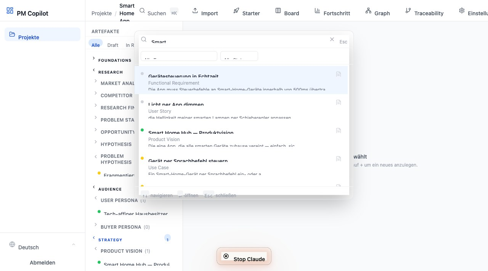

- Artifact title and type
- Status dot
- A snippet of matching field content with the match highlighted in context

### Filters

- **Type filter** — narrow to a specific artifact type
- **Status filter** — filter by Entwurf / In Prüfung / Fertig
- **Tag filter** — filter by a specific tag (shown only when the project has tags)

Filters can be combined with a text query or used alone.

### Navigating results

Use **arrow keys** to move between results, **Enter** to open the selected artifact, **Esc** to close the dialog.

---

## 13. Artifact Graph

The Artifact Graph is an interactive canvas where every artifact is a **node** and every relation is a **directed edge**. It gives you a bird's-eye view of the entire product knowledge graph and lets you create new connections by dragging directly on the canvas.

### Opening the Graph

Click **Graph** (network icon) in the explorer header.

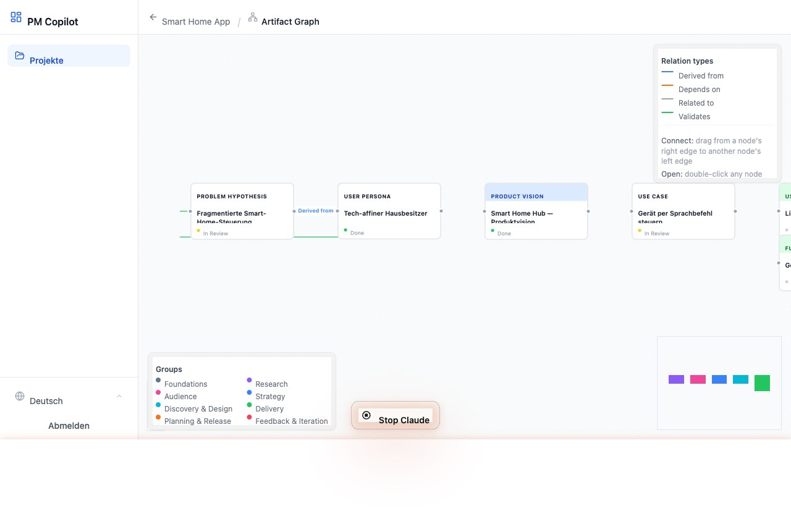

### Reading the graph

**Nodes** — each artifact is a card showing:
- A group-colored header with the artifact type
- The artifact title
- A status dot (green = Fertig, yellow = In Prüfung, grey = Entwurf)

**Edges** — each relation is a directed arrow with a label:

| Color | Animated | UI-Label |
|---|---|---|
| Blue | No | Abgeleitet von |
| Orange | Yes (dashes) | Abhängig von |
| Grey | No | Verknüpft mit |
| Green | No | Validiert |

The **Verknüpfungstypen** panel (top-right) shows relation colors. The **Gruppen** legend (bottom-left) shows the domain group of each node color.

### Navigating

- **Pan** — click and drag on the canvas background
- **Zoom** — scroll wheel, or use the zoom controls (bottom-left)
- **Fit view** — click the fit-view button in the controls to center all nodes
- **MiniMap** (bottom-right) — click to jump to any area of the graph

### Opening an artifact

**Double-click** any node to open that artifact in the Explorer.

### Creating a relation on the canvas

1. Hover over any node — small grey circles appear on its left and right edges (connection handles)
2. **Drag** from the **right handle** of the source artifact
3. **Drop** on the **left handle** of the target artifact
4. A dialog appears showing the two artifacts and asking for the relation type
5. The relation type is pre-suggested based on the artifact types (same smart suggestions as in the Explorer)
6. Click **Erstellen** — the edge appears on the canvas immediately

> Relations created on the graph are immediately visible in the Explorer's Relations section as well.

### Layout

Artifacts are arranged in **columns by domain group** (Foundations → Research → Audience → Strategy → Discovery & Design → Delivery → Planning & Release → Feedback & Iteration). Within each column, artifacts are stacked vertically. You can **drag nodes** to reposition them anywhere on the canvas.

---

## 14. Document Import

Import an existing PRD, specification, or any other project document and let the AI extract structured artifacts automatically.

### Opening the importer

Click **Import** (upload icon) in the project header. The button is visible to **Editors** and **Owners** only.

### Step 1 — Upload documents

Drag and drop files onto the upload area, or click to open the file picker. Supported formats:

| Format | Extension |
|---|---|
| PDF | `.pdf` |
| Word document | `.docx` |
| Plain text | `.txt` |
| Markdown | `.md` |

Limits: up to **5 files**, max **10 MB per file**. You can upload multiple files at once — the AI analyzes all of them together.

To remove a file before analyzing, click the **×** next to it.

### Step 2 — Analyze with AI

Click **Mit KI analysieren**. The AI reads the document text and extracts the following artifact types when it finds relevant content:

- Produktvision
- Problemstellung
- Ziele & Nicht-Ziele
- Nutzer-Persona / Käufer-Persona
- Stakeholder
- Annahme
- Marktanalyse
- Wettbewerber
- Wertversprechen
- KPI / OKR
- Anwendungsfall
- Feature

Each extracted artifact gets a suggested **title** and pre-filled **fields** based on what was found in the document.

> **Note:** The AI only extracts content that is actually present in the document — it does not invent information.

### Step 3 — Review proposals

The AI returns a list of proposed artifacts. For each one:

- A **checkbox** on the left lets you include or exclude it
- Click the **arrow icon** on the right to expand the card and preview the extracted field values
- Use **Alle auswählen / Alle abwählen** to select or deselect everything at once

If the results are not satisfactory, click **Neu analysieren** to discard the proposals and try again (e.g. after removing a noisy file).

### Step 4 — Create artifacts

Once you are happy with the selection, click **X Artefakte erstellen**. All selected artifacts are created in one batch with status **Entwurf** and a version history entry. You are then redirected to the Explorer where you can edit and refine each one.

---

## 15. Board View


The Board shows all artifacts as cards organised in three columns by status.

### Opening the Board

Click **Board** (columns icon) in the explorer header.

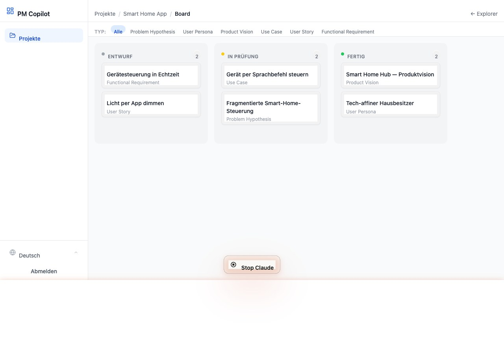

### Moving cards

Drag a card from one column to another to change its status (Entwurf / In Prüfung / Fertig). The change is applied immediately (optimistic update).

### Type filter

A toolbar above the board shows artifact types that have at least one artifact. Click a type to show only cards of that type. Click again to clear the filter.

### Opening an artifact from the board

Click any card title to open it in the Explorer detail panel.

---

## 16. Progress View

The Progress view shows how complete the product definition is across all 35 artifact types.

### Opening Progress

Click **Progress** (bar chart icon) in the explorer header.

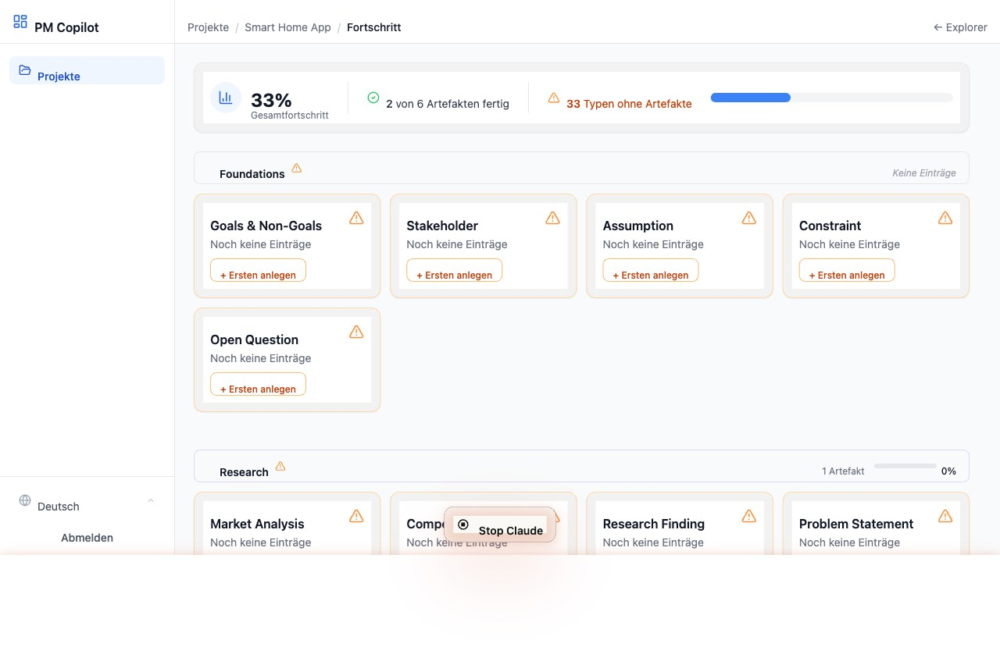

### Reading the view

- **Summary bar** at the top — overall progress percentage, count of completed types, count of missing types
- **Group cards** — one card per domain group, with a group-level progress bar
- Each card shows every artifact type in the group with a mini progress bar and status breakdown (green/yellow/grey dots)
- Types with no artifacts show an orange warning and a **+ Create** link

---

## 17. Traceability View

Traceability shows the entire artifact graph — who connects to whom, and what is isolated.

### Opening Traceability

Click **Traceability** (branch icon) in the explorer header.

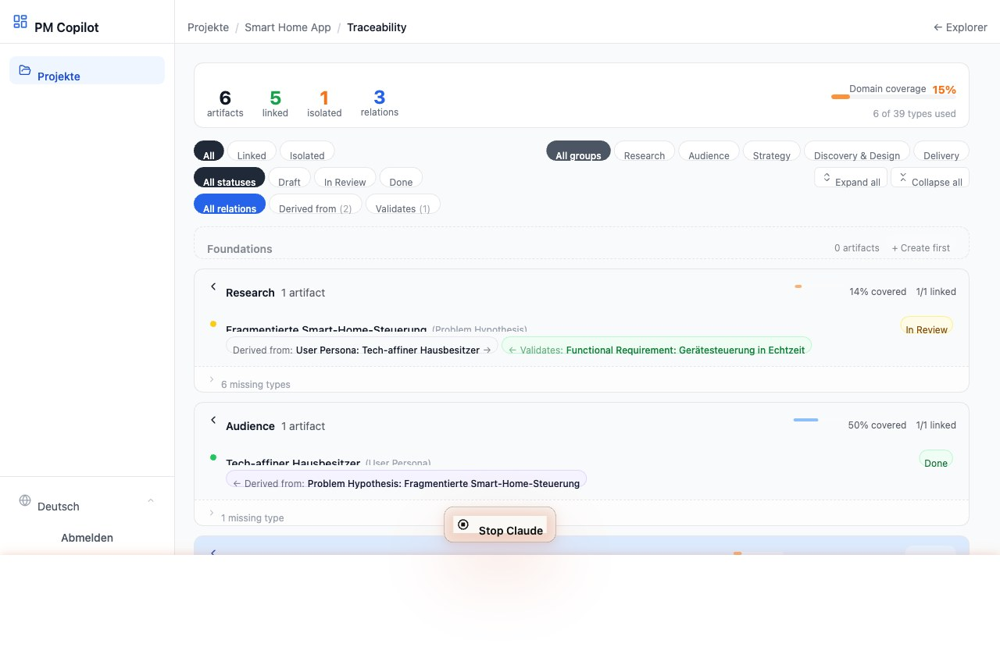

### Summary bar

Shows:
- Total artifacts in the project (**Artefakte**)
- Connected artifacts (**verknüpft**) — have at least one relation
- Isolated artifacts (**isoliert**) — no relations, shown in orange when > 0
- Total relation count (**Verknüpfungen**)
- **Domänenabdeckung** — percentage of all 35 artifact types that have at least one artifact in the project

### Filters

Three rows of filter pills:

1. **Visibility** — Alle / Verknüpft / Isoliert
2. **Status** — Alle Status / Entwurf / In Prüfung / Fertig
3. **Relation type** — Alle Verknüpfungen / Abgeleitet von (n) / Abhängig von (n) / Verknüpft mit (n) / Validiert (n); only shown for types that exist in the project

Clicking a count in the summary bar activates the corresponding filter automatically.

### Group sections

Artifacts are grouped by domain. Each group header shows:
- Total artifact count for the group
- A thin **coverage bar** — what percentage of the group's artifact types have at least one artifact (green ≥ 100%, blue ≥ 50%, orange < 50%)
- An **isoliert** badge when the group has unconnected artifacts

Click a group header to expand/collapse it. Use **Alle aufklappen** / **Alle zuklappen** buttons to control all groups at once.

### Gap detection

At the bottom of each group, a collapsible **fehlende Typen** section lists which artifact types in that group have no artifacts yet, with direct `+ [Typname]` links to create them.

### Connection badges

Each artifact row shows colored badges for its connections. Each badge shows:
- Arrow direction (← incoming, → outgoing)
- Relation type label (e.g. "Abgeleitet von:")
- Linked artifact type and title

Click any badge to open the linked artifact in the Explorer.

---

## 18. Roles and Permissions

Every project member has one of three roles.

| Action | Viewer | Editor | Owner |
|---|---|---|---|
| View artifacts, relations, comments | Yes | Yes | Yes |
| Add comments | Yes | Yes | Yes |
| Create / edit artifacts | No | Yes | Yes |
| Change artifact status | No | Yes | Yes |
| Delete artifacts | No | Yes | Yes |
| Add / remove relations | No | Yes | Yes |
| Add / remove tags | No | Yes | Yes |
| Request AI suggestions | No | Yes | Yes |
| Restore versions | No | Yes | Yes |
| Import documents (AI pre-fill) | No | Yes | Yes |
| Edit PRD Starter | No | Yes | Yes |
| Invite / remove members | No | No | Yes |
| Change member roles | No | No | Yes |
| Edit project name/description | No | No | Yes |
| Archive / delete project | No | No | Yes |

**Archived projects** are read-only for all roles — no writes are accepted, even for Owners.

---

## 19. Admin Area

The Admin area is accessible only to users with the **Admin** system role. It is visible in the sidebar under **Administration**.

### User Management (`/admin/users`)

Admins can:
- **View** all registered users with their system role and status
- **Create** users (first name, last name, email, password, role, status)
- **Edit** users — change name, email, role, status, or reset password
- **Deactivate** users (soft delete — they cannot log in but their data is preserved)

Admins cannot deactivate themselves or remove their own Admin role.

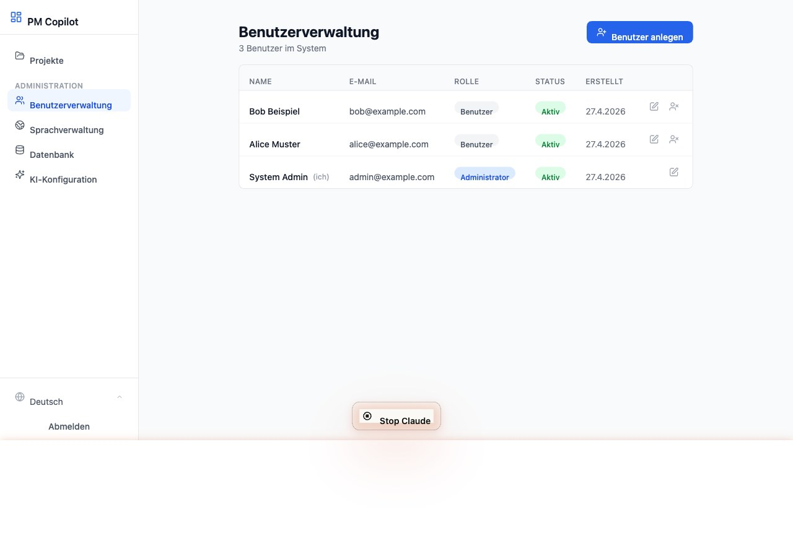

### Language Management (`/admin/languages`)

Manage which languages are available for the UI:

- **Add** a new language (language code, English name, native name)
- **Set default** — the language used when a user has no preference
- **Activate / Deactivate** — inactive languages are hidden from the language picker
- The default language cannot be deactivated or deleted

Users choose their preferred language via the **language picker** in the sidebar footer. The change takes effect immediately without a reload.

### Database Configuration (`/admin/database`)

Configure the database connection without editing files:

- Select **SQLite**, **PostgreSQL**, or **MariaDB**
- Enter connection details (or paste a raw connection URL)
- **Preview** the generated `DATABASE_URL`
- **Test connection** — verifies the credentials and reports the server version
- **Save** — writes to `.env.local`; a post-save checklist guides through the follow-up steps (update Prisma schema, run migrations, restart)

### AI Provider Configuration (`/admin/ai`)

Configure the AI assistant without a server restart:

- Select **Anthropic Claude**, **OpenAI**, or **Disabled**
- Choose a model (recommended models are marked)
- Enter the API key (masked; leave empty to keep the existing key)
- Set advanced options: timeout and max tokens
- **Test connection** — sends a minimal real request to verify the key
- **Save** — takes effect immediately for all subsequent AI requests

When disabled, the Ask AI button is hidden for all users.

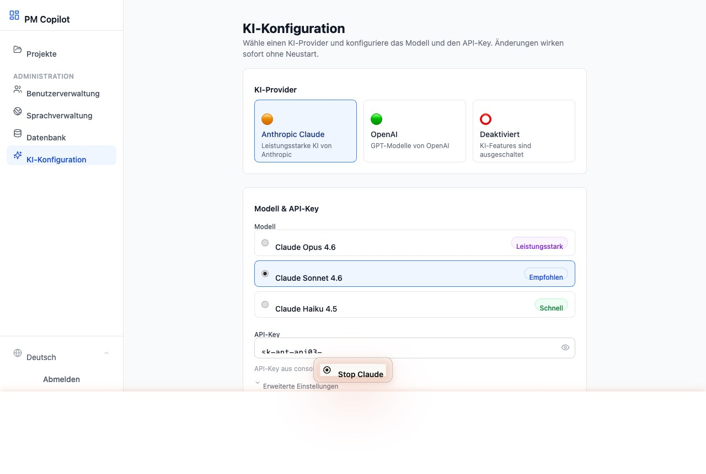

---

## 20. Keyboard Shortcuts

| Shortcut | Action |
|---|---|
| **Cmd+K** / **Ctrl+K** | Open search dialog |
| **Arrow Up / Down** | Navigate search results |
| **Enter** | Open selected search result |
| **Esc** | Close search dialog / cancel dialog |

---

## Appendix: Typical Workflow

Here is a recommended flow for a new project:

1. **Create the project** — enter name and description
2. **Import existing documents** (optional) — upload a PRD or spec and let the AI pre-fill artifacts
3. **Fill in the PRD Starter** — answer the 10 foundation questions
4. **Create a Produktvision** — the starter context panel shows your product idea answer
5. **Create a Problemstellung** — the panel shows questions 2, 4, and 5
6. **Create Nutzer-Personas** — the panel shows the target users answer
7. **Create Ziele & Nicht-Ziele** — derived from the vision; link them with an "Abgeleitet von" relation
8. **Create Anwendungsfälle and Features** — link back to personas and goals
9. **Create Epics and User Stories** — derived from features
10. **Add Abnahmekriterien and Funktionale Anforderungen** — link to stories
11. **Use AI suggestions** at any step to get field suggestions based on what you have already written
12. **Check Fortschritt** to see which types are missing
13. **Check Traceability** to find isolated artifacts and close gaps with relations
14. **Use the Board** to move artifacts through Entwurf → In Prüfung → Fertig as the team reviews them

---

*PM Copilot · Internal documentation · Not for distribution*
